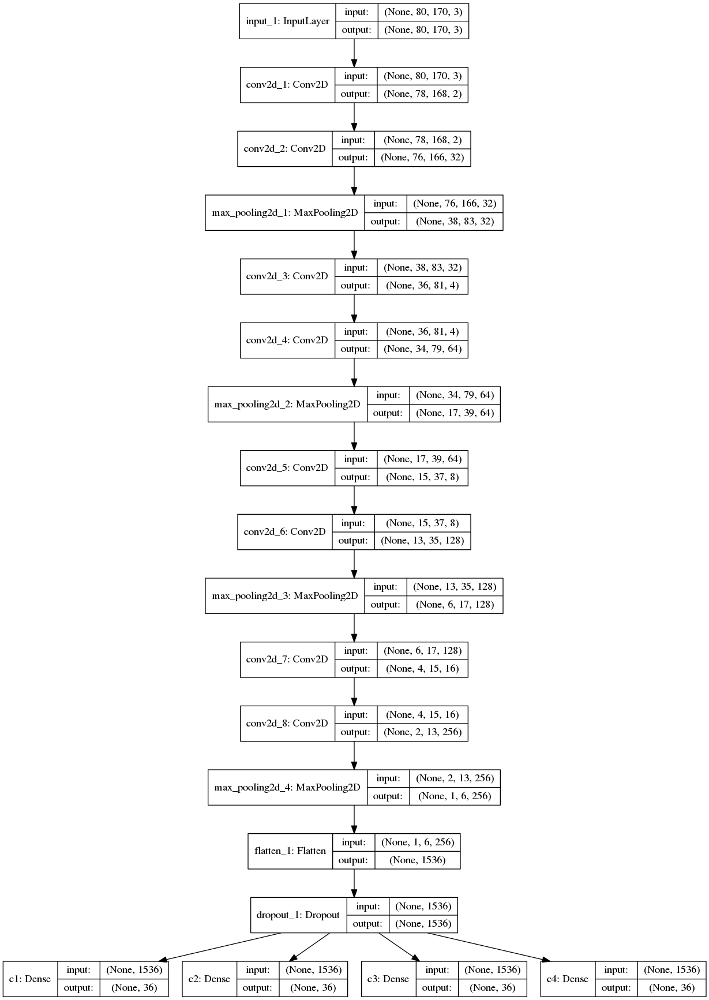
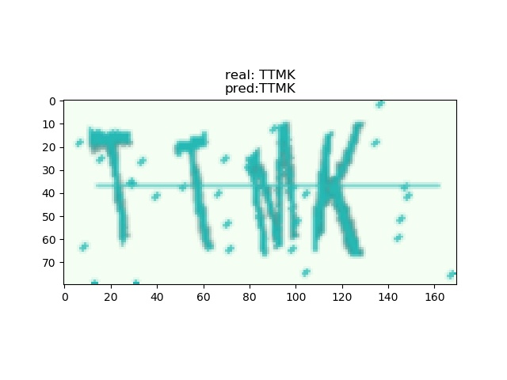

# 图片验证码的识别

## 项目简介

验证码识别是爬虫工程师在数据采集过程中经常遇到的问题，本项目通过 Keras 搭建了一个深度卷积神经网络，采用图片分类的方式，来解决验证码的识别问题。

## 获取数据集
我们利用 python 的 captacha 模块，定义了一个验证码图片的生成器，用于生成无限多的验证码图片。  
生成器的优点：可以在训练模型的过程中生成数据，而不必一次性生成大量数据。  
 数据生成器代码如下：
```python
def gen(batch_size=16, height=80, width=170, n_len=4, n_class=36):
    """
    生成器，默认每次生成16张验证码样本
    :param batch_size: 每次生成验证码个数
    :param height: 图片高度
    :param width: 图片宽度
    :param n_len: 验证码中数字/字母的个数
    :param n_class: 类别数
    :yield:
        :X: 图片数据，of shape (batch_size=16, height=80, width=170, 3)
        :y: one-hot 标签数据, of shape (4, batch_size=16, number of classes=36)
    """
    characters = string.digits + string.ascii_uppercase
    X = np.zeros((batch_size, height, width, 3), dtype=np.uint8)
    y = [np.zeros((batch_size, n_class), dtype=np.uint8) for i in range(n_len)]
    generator = ImageCaptcha(width=width, height=height)

    while True:
        for i in range(batch_size):
            random_str = ''.join([random.choice(characters) for j in range(4)])
            X[i] = generator.generate_image(random_str)
            for j, ch in enumerate(random_str):
                y[j][i, :] = 0
                y[j][i, characters.find(ch)] = 1
        yield X, y

```
使用生成器通过 next 函数调用即可，生成单个的验证码图片如下：


## one-hot 解码
在这里我们还对生成的 One-Hot 编码后的数据进行了解码，首先将它转为 numpy 数组，然后取36个字符中最大的数字的位置，因为神经网络会输出36个字符的概率，然后将概率最大的四个字符的编号转换为字符串。

```python
def decode(y):
    """
    将模型输出的 one-hot 解码成相应的4个数字/字母
    :param y: one-hot
    :return:
    """
    characters = string.digits + string.ascii_uppercase

    y = np.argmax(np.array(y), axis=2)[:,0]
    return ''.join([characters[x] for x in y])
```
## VGG16 网络结构介绍
2014年，牛津大学计算机视觉组（Visual Geometry Group）和Google DeepMind公司的研究员一起研发出了新的深度卷积神经网络：VGGNet，并取得了ILSVRC2014比赛分类项目的第二名（第一名是GoogLeNet，也是同年提出的）和定位项目的第一名。
VGGNet探索了卷积神经网络的深度与其性能之间的关系，成功地构筑了16~19层深的卷积神经网络，证明了增加网络的深度能够在一定程度上影响网络最终的性能，使错误率大幅下降，同时拓展性又很强，迁移到其它图片数据上的泛化性也非常好。到目前为止，VGG仍然被用来提取图像特征。

下图是来自论文《Very Deep Convolutional Networks for Large-Scale Image Recognition》（基于甚深层卷积网络的大规模图像识别）的VGG网络结构，正是在这篇论文中提出了VGG，如下图：
 

  

在这篇论文中分别使用了A、A-LRN、B、C、D、E这6种网络结构进行测试，这6种网络结构相似，都是由5层卷积层、3层全连接层组成，其中区别在于每个卷积层的子层数量不同，从A至E依次增加（子层数量从1到4），总的网络深度从11层到19层（添加的层以粗体显示），表格中的卷积层参数表示为“conv⟨感受野大小⟩-通道数⟩”，例如con3-128，表示使用3x3的卷积核，通道数为128。为了简洁起见，在表格中不显示ReLU激活功能。
其中，网络结构D就是著名的VGG16，网络结构E就是著名的VGG19。

本项目中采用的是 VGG16 结构，并做了适当的修改。

## 构建深度卷积神经网络
模型结构效仿经典的 VGG16 结构。添加 Dropout 尽量避免过拟合问题，最后连接四个分类器，每个分类器是36个神经元，输出36个字符的概率。  

训练模型直接使用 keras 中的 `model.fit_generator()`函数，该函数可利用生成器生成的训练集进行训练。由于数据是通过生成器随机生成的，所以不用考虑数据是否会重复。

训练结束后，利用 `model.save_weights()` 函数保存模型权重，以便再次利用。


训练环境： GTX 1060(6G)  
训练时长： 3 hours

```python
def model(height, width):
    """
    神经网络模型
    :param height: 图片高度
    :param width: 图片宽度
    :return:
    """
    input_tensor = Input((height, width, 3))
    x = input_tensor

    # VGG-16
    for i in range(4):
        x = Conv2D(2 * 2 ** i, 3, 3, activation='relu')(x)
        x = Conv2D(32 * 2 ** i, 3, 3, activation='relu')(x)
        x = MaxPooling2D((2, 2))(x)

    x = Flatten()(x)
    x = Dropout(0.25)(x)
    x = [Dense(n_class, activation='softmax', name='c%d' % (i + 1))(x) for i in range(4)]
    model = Model(input=input_tensor, output=x)

    model.compile(loss='categorical_crossentropy',
                  optimizer='adadelta',
                  metrics=['accuracy'])

    # 保存可视化结构图
    plot_model(model, to_file="model1.png", show_shapes=True)

    model.fit_generator(gen(), samples_per_epoch=51200, nb_epoch=5,
                        nb_worker=3, pickle_safe=True,
                        validation_data=gen(), nb_val_samples=1280)

    # 保存模型权重
    model.save_weights("model_.h5")

    return model
```

## 模型可视化

利用 Keras 自带的可视化工具，生成模型结构图如下：



## 测试模型

训练完成以后，用一个验证码进行测试：

```python
X, y = next(gen(1))
y_pred = model.predict(X)
plt.title('real: %s\npred:%s'%(decode(y), decode(y_pred)))
plt.imshow(X[0], cmap='gray')
```



## 计算模型总体准确率

模型在训练的时候只会显示每一个字符的准确率，为了统计模型的总体准确率，我们需要统计模型对于整张验证码图片的准确率，计算规则是只要有一个数字或字母为 False，那么验证码的预测结果为 False。

实现该函数使用了 tqdm 模块在控制台输出进度条，实时反馈进度。利用 `numpy.array_equal` 将真实值与预测值进行对比，统计模型预测的准确率，

通过随机的 200 个验证码图片进行统计，得出模型的总体准确率为 87.21%。


```python
def evaluate(model, batch_num=200):
    """
    计算模型的总体准确率
    :param model:
    :param batch_num:
    :return:
    """
    batch_acc = 0
    generator = gen()
    for i in tqdm(range(batch_num)):
        X, y = next(generator)
        y_pred = model.predict(X)
        y_pred = np.argmax(y_pred, axis=2).T
        y_true = np.argmax(y, axis=2).T二、VGG的网络结构
下图是来自论文《Very Deep Convolutional Networks for Large-Scale Image Recognition》（基于甚深层卷积网络的大规模图像识别）的VGG网络结构，正是在这篇论文中提出了VGG，如下图：
 
在这篇论文中分别使用了A、A-LRN、B、C、D、E这6种网络结构进行测试，这6种网络结构相似，都是由5层卷积层、3层全连接层组成，其中区别在于每个卷积层的子层数量不同，从A至E依次增加（子层数量从1到4），总的网络深度从11层到19层（添加的层以粗体显示），表格中的卷积层参数表示为“conv⟨感受野大小⟩-通道数⟩”，例如con3-128，表示使用3x3的卷积核，通道数为128。为了简洁起见，在表格中不显示ReLU激活功能。
其中，网络结构D就是著名的VGG16，网络结构E就是著名的VGG19。


        batch_acc += np.mean(list(map(np.array_equal, y_true, y_pred)))

    return batch_acc / batch_num
```

## 总结及展望

本项目通过搭建卷积神经网络，初步解决了验证码的识别问题，模型准确率达到 85~90%，足够用于网络采集的过程中。  
经过分析，预测失败的主要原因在于验证码中数字 0 和字母 O 的相似性和验证码中数字或字母的重叠。

以上两点缺陷也是未来需要解决的问题。
